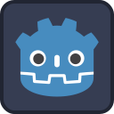

# VARLAB-Game-Jam<p align="center">
  
</p>

# Godot 4 Game - VARLab Code Jam

Welcome to my 2D platformer game created for the VARLab Code Jam. This project is an opportunity for me to dive into Godot and explore game development in this fantastic engine.

## Table of Contents
- [Game Overview](#game-overview)
- [Getting Started](#getting-started)
- [Features](#features)
- [Screenshots](#screenshots)
- [License](#license)

## Game Overview

This game is a 2D platformer, offering an exciting mix of platforming challenges and puzzles that keeps the gameplay fresh and engaging.

## Getting Started

To run the game locally, follow these steps:

1. Clone this repository:

   ```bash
   git clone https://github.com/yourusername/your-godot-game.git
   ```
2. Open the project in Godot Engine.
3. Start exploring the game!

## Features
* Exciting 2D platformer action.
* Unique power-ups and enemies to discover.
* and more!

## Screenshots

## License
This project is licensed under the MIT License - see the LICENSE file for details.
